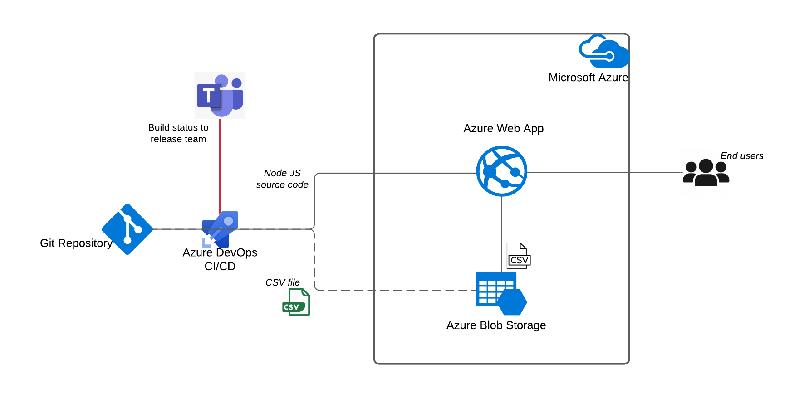

# Overview

The **Web CSV Viewer** is a simple online web application which displays the contents of CSV file located in Azure Cloud. 

## Folders
* [WebApplication](./WebApplication): Contains the Node JS code of the web application.
* [Resources](./Resources/Data): Contains the CSV data file needed for the application, and the image files used in this README document.

# Architecture
The web application is built using [Node.js](https://nodejs.org/en/) and [Express](https://expressjs.com/) framework.

The web application is hosted on [Azure App Service](https://portal.azure.com/#@inlinemarket.fi/resource/subscriptions/2a3e926c-d151-4e4b-8d5d-1479bbfbe014/resourceGroups/inline-exercise-rg/providers/Microsoft.Web/sites/webcsvviewerneustgwa/appServices). The source CSV file is located in [Azure blob Storage](https://portal.azure.com/#blade/Microsoft_Azure_Storage/ContainerMenuBlade/overview/storageAccountId/%2Fsubscriptions%2F2a3e926c-d151-4e4b-8d5d-1479bbfbe014%2FresourceGroups%2Finline-exercise-rg%2Fproviders%2FMicrosoft.Storage%2FstorageAccounts%2Fwebcsvviewerneustgsa/path/input/etag/%220x8D9E1B5B8749EB8%22/defaultEncryptionScope/%24account-encryption-key/denyEncryptionScopeOverride//defaultId//publicAccessVal/None).

Continuous Integration and Deployments are enabled using [Azure DevOps CI/CD pipelines](https://azure.microsoft.com/en-us/services/devops/pipelines/). 

The deployment notifications are sent to InlineMarket's Teams channel `Playground`.

## Detailed design




## Environment setup

### Local environment
#### Installation Prerequisites
1. Install [Git](https://git-scm.com/downloads) and clone the repository.      
    `git clone git@github.com:krishnaannugula/webapplication-csv-viewer.git`

1. Install [Node.js](http://nodejs.org/).

1. Application development framework
    * You can use your preferred code editor or development framework for developing [Node.js](https://nodejs.org/en/) applications, but I recommend using [Visual Studio Code](https://code.visualstudio.com/download) because of it's simplicity, robustness and availability of community license.
    * Install [Azure App Service](https://marketplace.visualstudio.com/items?itemName=ms-azuretools.vscode-azureappservice) extension in Visual Studio Code.

1. To start the application locally, go to the `WebApplication`folder
    * Modify [.env](./WebApplication/.env) file
        ```
        AZURE_STORAGE_CONNECTION_STRING = <GET THIS VALUE FROM YOUR DEVOPS ADMIN>
        AZURE_STORAGE_CONTAINER         = "input" 
        CSV_BLOB_FILE                   = "us-500.csv"
        PORT                            = 3000
        ```
    * Run the following commands in command terminal
        ```sh
        npm install
        npm start dev
        ```
    * Your web application should now be running locally on [localhost:3000](http://localhost:3000/).

### Deploying to Azure

1. As soon as the code changes are pushed to [master](https://github.com/krishnaannugula/webapplication-csv-viewer) branch, the Azure DevOps CI/CD pipeline [webapplication-csv-viewer](https://dev.azure.com/inlinemarket/Playground/_build?definitionId=30) is automatically triggered which compiles the code, generates the artifact, and publishes the artifact to Azure staging and production environments.

1. Upon successful deployments, the web applications are accessible using the following links.
    * Staging - [webcsvviewerneustgwa](https://webcsvviewerneustgwa.azurewebsites.net/)
    * Production - [webcsvviewerneuprodwa](https://webcsvviewerneuprodwa.azurewebsites.net/)
	

1. Watch for the deployment notifications in Microsoft Teams `Playground` channel.

##### Below is the sample image	


### Teams Notification
1. Regardless of build status, once deployment is complete, Azure pipeline will send notifications to the release team via the Microsoft teams channel.

##### Below is the sample image


